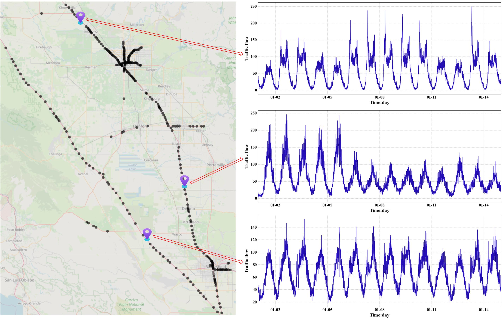

# 🚦 PEMS06 Dataset

## 📖 Introduction

The **PEMS06** dataset is collected from District 6 of the California Transportation Agencies (Caltrans), covering the period from **January 1, 2025, to February 28, 2025**.

- **Scale**: 651 sensor nodes, 16,992 time steps.
- **Split**: Train:Validation:Test = **6:2:2**.

> *Figure: Spatial distribution of PEMS06 sensor nodes and traffic flow sequences.*

## ⚙️ Data Processing

1. **Preprocessing**:
   - **Missing Values**: Imputed using observations from the corresponding time interval in the preceding period.
   - **Normalization**: Z-Score normalization is applied ($x' = \frac{x - \mu}{\sigma}$).

2. **Adjacency Matrix**:
   - Constructed based on road network distances using a thresholded Gaussian kernel (following DCRNN).
   - Threshold $\mathcal{K}=0.1$; edges with weights below this value are discarded.

## 📥 Download

- **Google Drive **: [Download Link](https://drive.google.com/drive/folders/1_dbrXhiwOChNqMPr3PonKJ_Vh-oUYGN-?usp=sharing)
